# Pflichtenheft - TeamC2

* **Projektname:** ParkBlazer
* **Product Owner:** Tim Röckemann, Marvin Petschulat, Jan-Ole Löffler, Timo Haverich, Edwin Dik, Bent Schöne, Mattis Wellenbüscher
* [Link zum Source Code Repository](https://github.com/TeamC2-Softwareprojekt)

# 1 Einführung

## 1.1 Beschreibung
Die Produktvision von **ParkBlazer** ist es, eine innovative Plattform zu schaffen, die die Art und Weise revolutioniert, wie Autofahrer Parkplätze finden und nutzen. Wir streben danach, Verkehrsstaus und Umweltbelastungen in urbanen Gebieten zu reduzieren, indem wir eine Community-basierte Lösung bieten, die es Nutzern ermöglicht, unentdeckte Parkplätze zu finden und private Parkplätze zu mieten bzw. vermieten. **ParkBlazer** wird durch den Community-basierten Ansatz die Parkplatzsuche vereinfachen und gleichzeitig die Verfügbarkeit von Parkplätzen erhöhen. Durch die Möglichkeit, private Parkplätze über einen bestimmten Zeitraum von anderen Nutzern mieten zu können, schafft **ParkBlazer** eine flexible und kostengünstige Alternative zum herkömmlichen Parken. Dies ermöglicht es Nutzern, ihren Parkbedarf je nach Bedarf anzupassen und gleichzeitig privaten Parkplatzanbietern die Möglichkeit zu geben, ihre ungenutzten Parkplätze zu monetarisieren und die Parkraumnutzung in städtischen Gebieten zu optimieren. Unsere Plattform wird auf Benutzerfreundlichkeit, Zuverlässigkeit und Innovation setzen, um ein nahtloses und effizientes Parkerlebnis zu gewährleisten und die Lebensqualität in städtischen Gebieten zu verbessern.

# 2 Anforderungen

## 2.1 Stakeholder
| Funktion / Relevanz                                                             | Name                 | Kontakt / Verfügbarkeit       |
| ------------------------------------------------------------------------------- | -------------------- | ----------------------------- |
| Product Owner, DevOps-Engineer, Backend-Entwickler                              | Timo Haverich        | timo.haverich@hsbi.de         |
| Product Owner, UX/UI Designer, Soundentwickeler, Frontend-Entwickler (App-Team) | Marvin Petschulat    | marvin.petschulat@hsbi.de     |
| Product Owner, Frontend-Entwickler (Web-Team), DevOps-Engineer                  | Edwin Dik            | edwin.dik@hsbi.de             |
| Product Owner, Frontend-Entwickler (Web-Team)                                   | Bent Schöne          | bent.schoene@hsbi.de          |
| Product Owner, Frontend-Entwickler (Web-Team)                                   | Mattis Wellenbüscher | mattis.wellenbuescher@hsbi.de |
| Product Owner, UX/UI Designer, Frontend-Entwickler (App-Team), DevOps-Engineer  | Tim Röckemann        | tim.roeckemann@hsbi.de        |
| Product Owner, UX/UI Designer, Frontend-Entwickler (App-Team)                   | Jan-Ole Löffler      | jan-ole_timo.loeffler@hsbi.de |

## 2.2 Funktionale Anforderungen
- Die Use Cases wurden in folgende funktionale Gruppen strukturiert:
    - Authentifizierung und Zugriffssteuerung
    - Profilverwaltung
    - Bestellungsverwaltung
    - Parkplatzsuche
    - Parkplatz anlegen
    - Parkplatz mieten/vermieten
    - Parkplatz bewerten

- Definition der Akteure:
    - Registrierter Benutzer: Benutzer des Systems, der auf alle Funktionen zugreifen kann.
    - Anonymer Benutzer: Benutzer des Systems, der auf frei zugängliche Funktionen zugreifen kann (Parkplatzsuche).

## 2.3 Nicht-funktionale Anforderungen

### 2.3.1 Rahmenbedingungen
- **Kollaborative Softwareentwicklung mit Github im Team:**
  - Einrichten eines gemeinsamen Github-Repositories für das Projekt.
  - Nutzung von Branches für die parallele Entwicklung verschiedener Funktionen oder Features.
  - Verwendung von Pull Requests für Code-Reviews und die Integration von Änderungen in den Hauptcode.
  - Verfolgung von Aufgaben und Fortschritt mithilfe von Issues und Projekt-Boards.

- **Planung und Durchführung des Softwareprojekts:**
  - Festlegung der Anforderungen und Spezifikationen in Zusammenarbeit mit dem Team und den Stakeholdern.
  - Einteilung der Arbeit in Iterationen oder Sprints, um kontinuierliche Verbesserungen und Lieferungen zu ermöglichen.
  - Regelmäßige Meetings zur Überprüfung des Fortschritts, zur Identifizierung von Hindernissen und zur Anpassung des Plans, falls erforderlich.
  - Durchführung von Tests und Qualitätssicherungsmaßnahmen während des gesamten Entwicklungsprozesses.

- **Anwendung agiler Vorgehensmodelle (Scrum, Kanban-Board):**
  - Nutzung eines Kanban-Boards zur Visualisierung des Arbeitsfortschritts und zur Priorisierung von Aufgaben.
  - Verwendung von Scrum-Meetings wie Sprint-Planung, Daily Standups und Sprint-Reviews, um den Fortschritt zu überprüfen und Herausforderungen anzugehen.
  - Kontinuierliche Verbesserung durch retrospektive Meetings, um Erfahrungen zu reflektieren und Anpassungen vorzunehmen.

- **Erweiterung der Kompetenzen durch Einarbeitung in neue Technologien:**
  - Identifizierung von neuen Technologien oder Tools, die für das Projekt nützlich sein könnten.
  - Planung von Zeit für die Einarbeitung und das Erlernen neuer Technologien innerhalb des Teams.
  - Durchführung von Experimenten, Prototypen oder kleinen Projekten, um praktische Erfahrungen zu sammeln.

- **Selbstständigkeit im Lernen, Verstehen, Planen, Organisieren, Kommunizieren, Präsentieren und Zusammenarbeit im Team:**
  - Eigenverantwortung für die Fortbildung und das Verständnis neuer Konzepte oder Technologien.
  - Effektive Planung und Organisation von Arbeitsaufgaben und Zeit.
  - Klare und offene Kommunikation im Team, um Ideen auszutauschen, Herausforderungen zu besprechen und Lösungen zu finden.
  - Fähigkeit, Ergebnisse und Fortschritte präsentieren zu können, sowohl innerhalb des Teams als auch gegenüber Stakeholdern.
  - Zusammenarbeit und Unterstützung anderer Teammitglieder, um gemeinsame Ziele zu erreichen und eine positive Arbeitsumgebung zu fördern.

### 2.3.2 Betriebsbedingungen
- Das Softwareprodukt kann als Webanwendung, mobile Anwendung, eingebettete Software oder Desktop-Software realisiert werden.
- Es kann in einer oder mehreren Programmiersprachen implementiert werden, je nach den Anforderungen und Präferenzen des Teams.
- Eine graphische Benutzerschnittstelle ist obligatorisch und muss vorhanden sein.
- Die Verwendung einer Datenbank ist erforderlich, um Daten zu speichern und abzurufen.
- Die Entwicklung von mehreren "Frontends" für das Softwareprodukt wird empfohlen, insbesondere bei einem Team von mehr als 2 Personen.
- Diese "Frontends" können webbasiert, für mobile Endgeräte oder für Sprachassistenten sein, um eine breitere Benutzerbasis zu erreichen und die Benutzererfahrung zu verbessern.

### 2.3.3 Qualitätsmerkmale
* Externe Qualitätsanforderungen (z.B. Performance, Sicherheit, Zuverlässigkeit, Benutzerfreundlichkeit)

|      Qualitätsmerkmal      | sehr gut |  gut  | normal | nicht relevant |
| :------------------------: | :------: | :---: | :----: | :------------: |
|    **Zuverlässigkeit**     |          |       |        |                |
|       Fehlertoleranz       |    X     |   -   |   -    |       -        |
|   Wiederherstellbarkeit    |    X     |   -   |   -    |       -        |
|     Ordnungsmäßigkeit      |    X     |   -   |   -    |       -        |
|        Richtigkeit         |    X     |   -   |   -    |       -        |
|        Konformität         |    -     |   X   |   -    |       -        |
| **Benutzerfreundlichkeit** |          |       |        |                |
|     Installierbarkeit      |    -     |   -   |   X    |       -        |
|      Verständlichkeit      |    X     |   -   |   -    |       -        |
|       Erlernbarkeit        |    -     |   -   |   X    |       -        |
|       Bedienbarkeit        |    X     |   -   |   -    |       -        |
|      **Performance**       |          |       |        |                |
|       Zeitverhalten        |    X     |   -   |   -    |       -        |
|         Effizienz          |    X     |   -   |   -    |       -        |
|       **Sicherheit**       |          |       |        |                |
|      Analysierbarkeit      |    X     |   -   |   -    |       -        |
|     Modifizierbarkeit      |    X     |   -   |   -    |       -        |
|         Stabilität         |    -     |   X   |   -    |       -        |
|        Prüfbarkeit         |    X     |   -   |   -    |       -        |

## 2.4 Graphische Benutzerschnittstelle

### App
**Login**
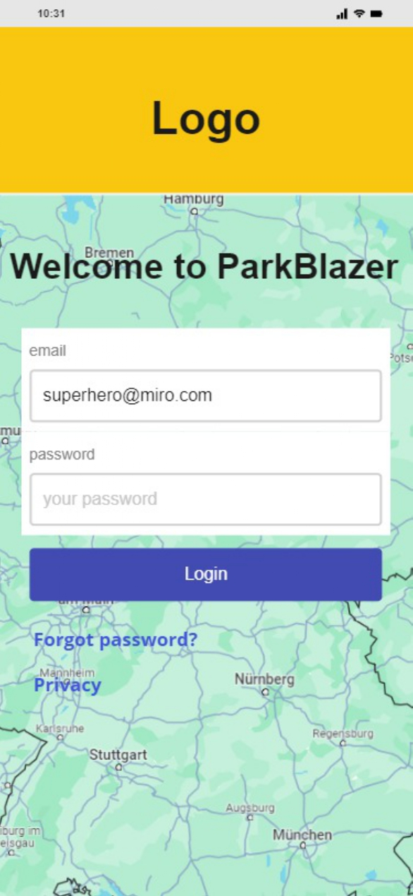

**Starseite**
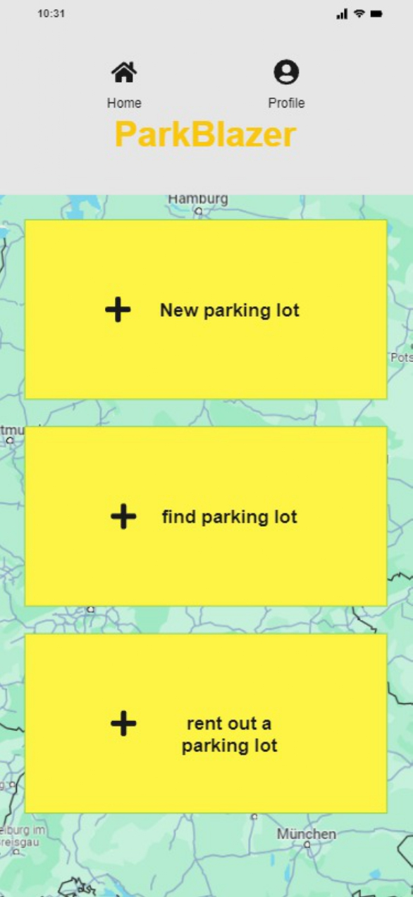

**Neuer Parkplatz: Suche der Adresse**

**Neuer Parkplatz: Hinzufügen**
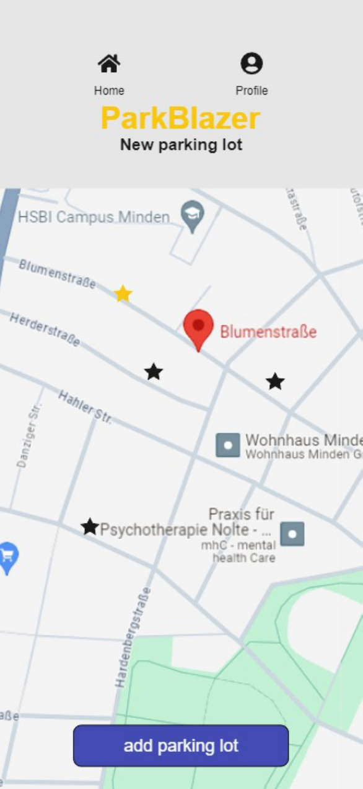

**Neuer Parkplatz: Details hinzufügen**
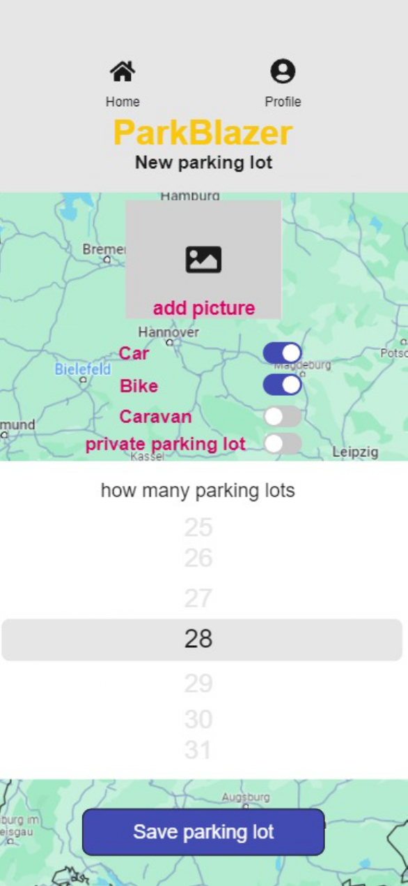

**Parkplatz suchen: Adresse**
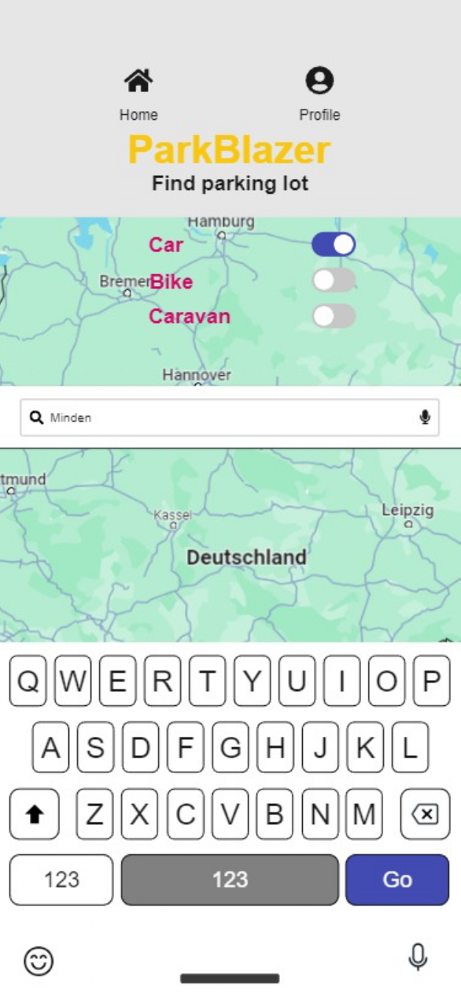

**Parkplatz suchen: Auswahl der Parkplätze**
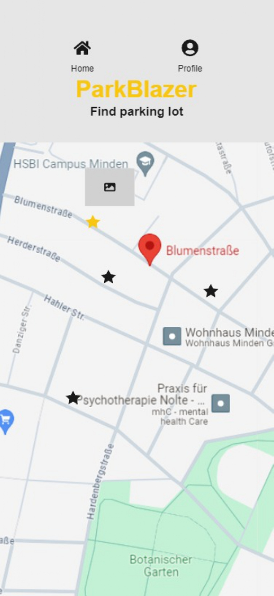

**Parkplatz suchen: Parkplatzdetails**
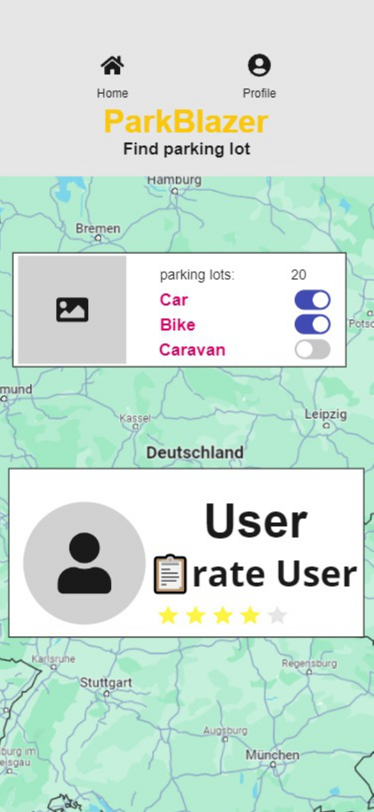

**Parkplatz vermieten: Adresse suchen**
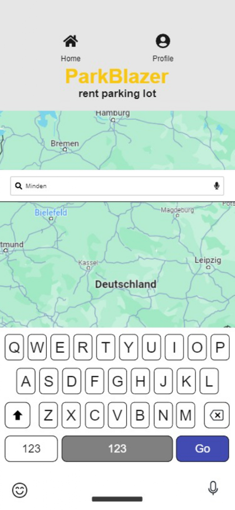

**Parkplatz vermieten: Parkplatz hinzufügen**
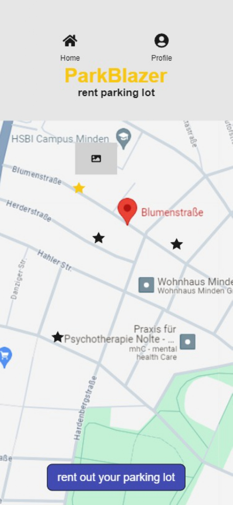

**Parkplatz vermieten: Parkplatzdetails und Verifizierung**
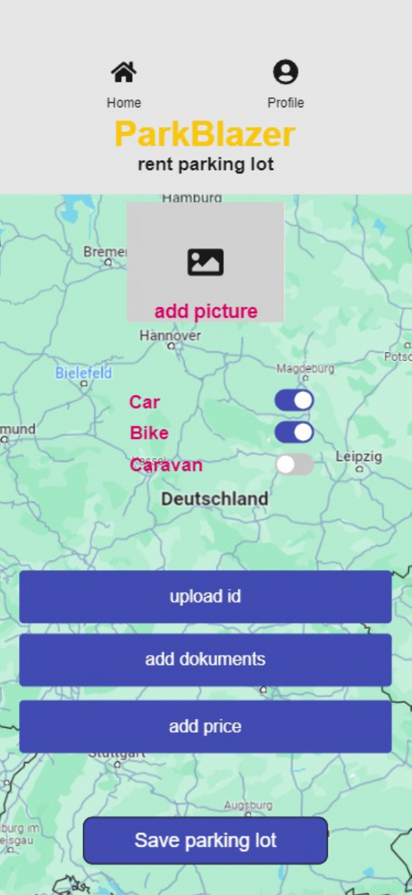

**Profil: Berwertungen**

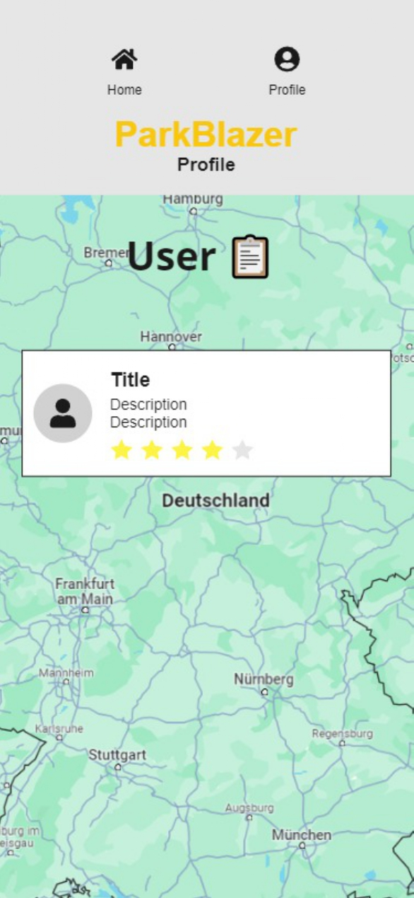

### Web
**Startseite**
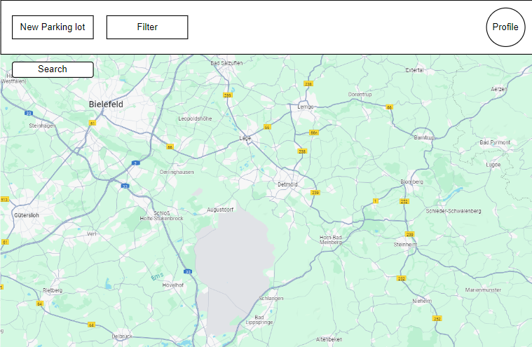
**Filter**
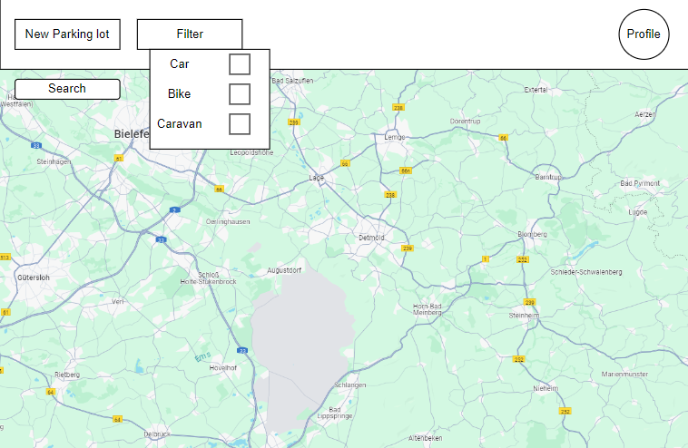
**Parkplatz Details**
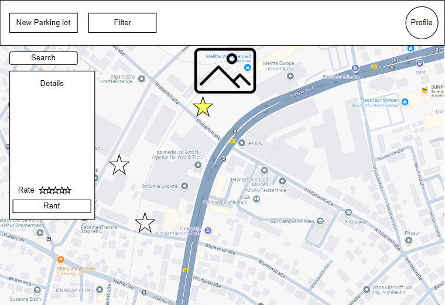
**Neuen Parkplatz hinzufügen**
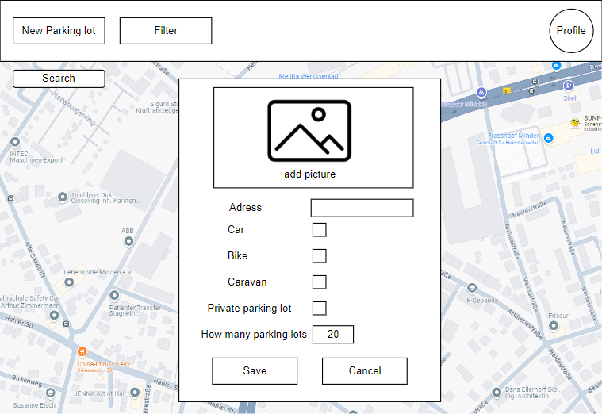
**Privaten Parkplatz hinzufügen**
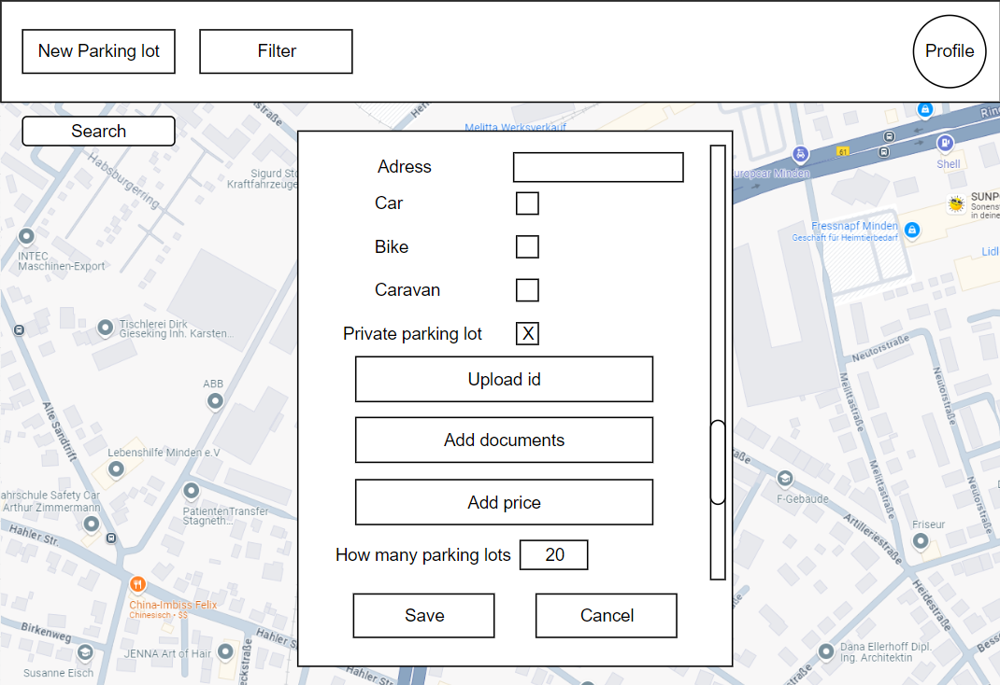

## 2.5 Anforderungen im Detail
| Als                    | möchte ich                                           | so dass                                                                       | Akzeptanz                                                                                                     |
| :--------------------- | :--------------------------------------------------- | :---------------------------------------------------------------------------- | :------------------------------------------------------------------------------------------------------------ |
| Autofahrer             | freie Parkplätze in meiner Nähe finden               | ich weniger Zeit mit der Parkplatzsuche verbringe                             | Die App zeigt verfügbare Parkplätze auf einer Karte an                                                        |
| Registrierter Benutzer | angezeigte Parkplätze bewerten können                | die Qualität und Verfügbarkeit der Parkplätze bewertet werden kann            | Die App bietet eine Möglichkeit zur Bewertung der angezeigten Parkplätze                                      |
| Registrierter Benutzer | verfügbare Parkplätze zur Karte hinzufügen           | dieser anderen Benutzern auf der Karte angezeigt wird                         | Die App bietet die Möglichkeit einen Parkplatz zur Karte hinzuzufügen                                         |
| Parkplatzbesitzer      | meinen nicht genutzten Parkplatz vermieten           | ich zusätzliches Einkommen generieren kann                                    | Ein Mietvertrag kann über die Plattform abgeschlossen werden                                                  |
| Umweltbewusster Nutzer | eine App zur Parkplatzsuche nutzen                   | ich zur Reduzierung von Verkehrsstaus und Umweltbelastungen beitrage          | Die App bietet Informationen über die Auswirkungen der Parkraumnutzung auf die Umwelt                         |
| Pendler                | Parkplätze für bestimmte Zeiten reservieren          | ich sicher sein kann, dass ein Parkplatz verfügbar ist, wenn ich ihn benötige | Nutzer können Reservierungen für bestimmte Zeiten und Tage vornehmen                                          |  |
| Stadtbewohner          | langfristige Parkmöglichkeiten mieten                | ich mir keine täglichen Sorgen um die Parkplatzsuche machen muss              | Nutzer können Parkplätze für Wochen oder Monate mieten                                                        |
| Tourist                | Informationen über Parkgebühren und -regeln erhalten | ich Parkstrafen vermeiden kann                                                | Die App bietet detaillierte Informationen zu lokalen Parkvorschriften und Kosten                              |
| Entwickler             | Feedback von Nutzern erhalten                        | ich die Anwendung verbessern und benutzerfreundlicher machen kann             | Ein Feedback-System ist integriert, das Nutzerbewertungen und -vorschläge sammelt                             |
| Stadtplaner            | Daten über Parkraumnutzung analysieren               | städtische Verkehrs- und Parkraumplanung optimiert werden kann                | Die App stellt Daten zu Parkgewohnheiten und Spitzenzeiten sowie Statistiken und Nutzungsmuster zur Verfügung |
| Event-Organisator      | verfügbare Parkplätze für Eventbesucher anbieten     | Besucher leichter einen Parkplatz finden und pünktlich sein können            | Nutzer können Parkplätze speziell für Veranstaltungen reservieren                                             |

# 3 Technische Beschreibung

## 3.1 Systemübersicht / Systemarchitekturdiagramm
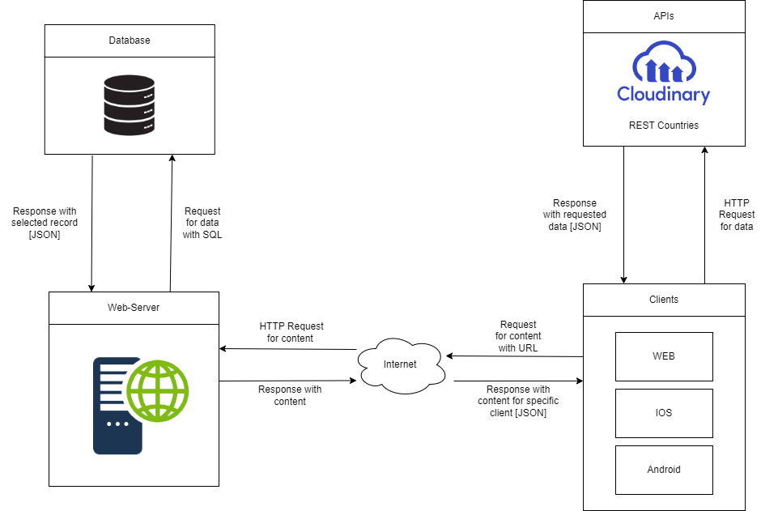

## 3.2 Softwarearchitektur
### Server
Der Server ist das zentrale Element der Plattform, das die Geschäftslogik und die Datenhaltung verwaltet. Der Server greift auf APIs und die Datenbank zu und sendet die Daten zurück an den anfordernden Client.

#### Logik-Schicht
- **Aufgaben:** Empfängt und verarbeitet Anfragen von Clients über das Web.
- **Technologien:** Node.js, Express.js, JsonWebToken

### Client
Der Client ist die Benutzeroberfläche, über die Nutzer mit der ParkBlazer-Plattform interagieren können. Er greift außerdem direkt auf ausgewählte APIs zu, um die Serverlast zu verringern und unnötige Wartezeiten für benutzerkritische Daten wie Kartendaten zu eliminieren.

#### UI-Schicht / Logik-Schicht
- **Aufgaben:** Darstellung der Benutzeroberfläche auf verschiedenen Plattformen (Web, Mobile) sowie Verarbeitung von Daten aus der Kommunikations-Schicht. Die Schichten sind eng miteinander gekoppelt, da UI-Elemente und Logik durch React in denselben Dateien verarbeitet werden.
- **Technologien:** React, JSX/TypeScript, Ionic für Web- und App-Integration, MapTiler, REST Countries.

#### Kommunikation-Schicht
- **Aufgaben:** Handhabt die Kommunikation zwischen Client und Server über das Netzwerk.
- **Technologien:** Axios, Cloudinary, TypeScript

### 3.2.1 Technologieauswahl
- DB: MySQL
- Server: Node.js, Express.js, JavaScript, JsonWebToken zur Nutzerauthentifizierung
- Clients: Ionic für Web- und App-Integration, JavaScript/TypeScript (Web), Java (Anroid), Gradle (Android), Swift (IOS), MapTiler für die Kartenintegration, React, Axios für HTTP-Requests, date-fns für Daten formatierung
- Externe APIs: Cloudinary als Cloud für von Nutzern hochgeladene Bilder, REST Countries
- Datenformate: JSON
- Allgemeine Technologien: GitHub als Versionsverwaltung, GitHub Actions für CI/CD, GitHub projects für das Kanban-Board, npm als Paketmanager

## 3.3 Schnittstellen
- Cloudinary, REST Countries -> Clients
- JsonWebToken -> Server (Backend) -> Clients
- Datenbank -> Server (Backend) -> Clients

| Endpunkt                                      | Parameter                                                                                                                                                                     | Rückgabe                                                    |
|-----------------------------------------------|--------------------------------------------------------------------------------------------------------------------------------------------------------------------------------|-------------------------------------------------------------|
| POST /api/register_user                       | username, email, password, firstname, lastname, birthdate, street, house_number, zip, city, country                                                                           | "Nutzer erfolgreich registiert!"                            |
| POST /api/login_user                          | email, password                                                                                                                                                               | jwtToken, username                                          |
| POST /api/reduce_user_point/:points           | jwtToken, points                                                                                                                                                              | "Punkte reduziert."                                         |
| POST /api/update_user                         | jwtToken, password, city, street, zip, house_number, country                                                                                                                  | "Nutzer aktualisiert!"                                      |
| POST /api/get_parkingspots_created_by_user    | username                                                                                                                                                                      | Alle Parkplätze eines bestimmten Nutzers                    |
| POST /api/create_parkingspot                  | jwtToken, name, description, available_spaces, image_url, latitude, longitude, type_car, type_bike, type_truck, street, house_number, zip, city, country                      | "Neuer Parkplatz wurde erfolgreich angelegt! (+50 Punkte)"  |
| POST /api/get_parkingspot_details             | parkingspot_id                                                                                                                                                                | JSON Objekt mit Parkplatz details                           |
| POST /api/create_privateparkingspot           | jwtToken, name, description, available_spaces, image_url, latitude, longitude, type_car, type_bike, type_truck, street, house_number, zip, city, country, availability_start_date, availability_end_date, price_per_hour | "Neuer private Parkplatz wurde erfolgreich angelegt! (+70 Punkte)" |
| POST /api/create_review                       | jwtToken, rating, comment, parkingspot_id                                                                                                                                     | "Die Bewertung wurde erfolgreich angelegt!"                 |
| POST /api/get_reviews_of_parkingspot          | parkingspot_id                                                                                                                                                                | Alle Bewertungen eines bestimmten Parkplatzes               |
| POST /api/create_reservation                  | jwtToken, start_date, end_date, private_parkingspot_id, amount, payment_method                                                                                                | "Die Reservierung und die Rechnung wurden erfolgreich angelegt! (+50 Punkte)" |
| POST /api/insert_parking_availability_report  | jwtToken, parkingspot_id, available_spaces                                                                                                                                    | "Meldung erfolgreich übermittelt! (+20 Punkte)"             |
| POST /api/insert_parking_report               | jwtToken, parkingspot_id, report_type, description                                                                                                                            | "Meldung erfolgreich übermittelt! (+10 Punkte)"             |
| DELETE /api/delete_parkingspot/:id            | jwtToken, parkingspot_id                                                                                                                                                      | "Parkplatz wurde erfolgreich gelöscht!"                     |
| PUT /api/update_parkingspot/:id               | jwtToken, parkingspot_id, name, description, available_spaces, image_url                                                                                                      | "Parkplatz wurde erfolgreich aktualisiert!"                 |
| GET /api/get_user_details                     | jwtToken                                                                                                                                                                      | JSON Objekt mit details zum Nutzer                          |
| GET /api/get_parkingspots                     | Keine Parameter                                                                                                                                                               | Alle Parkplätze                                             |
| GET /api/get_privateparkingspots              | Keine Parameter                                                                                                                                                               | Alle privaten Parkplätze                                    |
| GET /api/get_reviews                          | Keine Parameter                                                                                                                                                               | Alle Bewertungen                                            |
| GET /api/user_reservations                    | jwtToken                                                                                                                                                                      | Alle Reservierungen des Nutzers                             |
| GET /api/reservation_invoice/:reservationId   | jwtToken, reservationId                                                                                                                                                       | Die Rechnungen einer bestimmten Reservierung                |
| GET /api/user_invoices                        | jwtToken                                                                                                                                                                      | Alle Rechnungen des Nutzers                                 |
| GET /api/get_reservations/:parkingspot_id     | parkingspot_id                                                                                                                                                                | Alle Reservierungen für einen bestimmten Parkplatz          |
| GET /api/parking_availability_reports/:parkingspot_id | parkingspotId                                                                                                                                                             | Alle verfügbarkeits Meldungen für einen bestimmten Parkplatz|
| GET /api/user_reports                         | jwtToken                                                                                                                                                                      | Alle Meldungen des Nutzers                                  |

## 3.4 Datenmodell
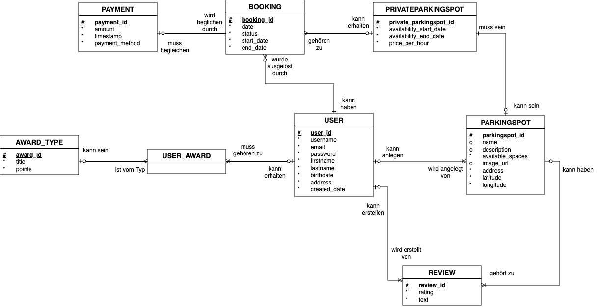

## 3.5 Abläufe

**Ablaufdiagramm der Startseite**
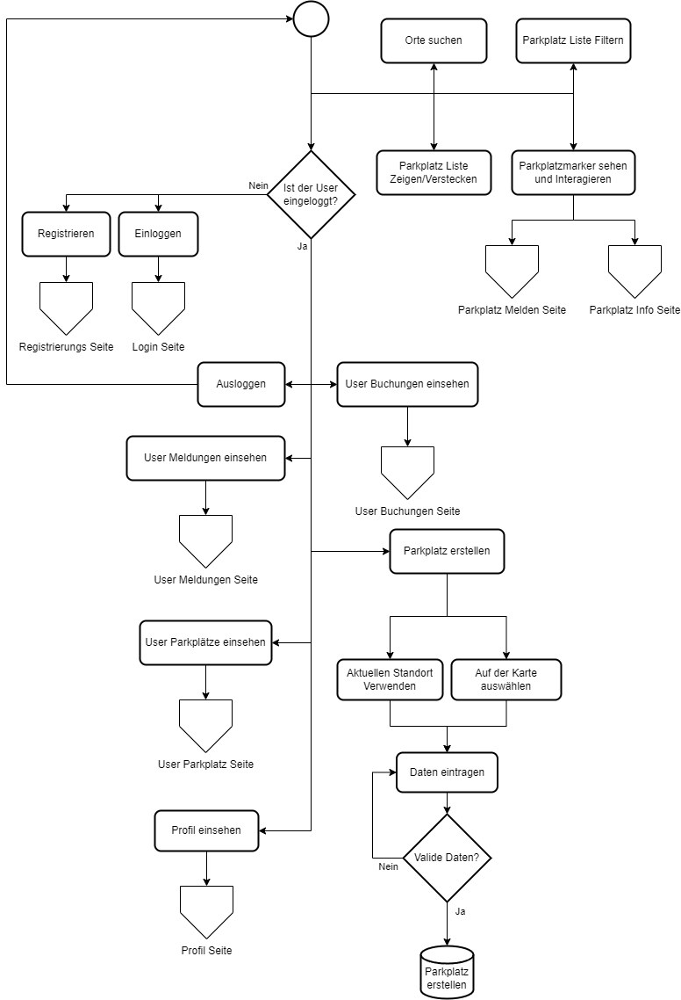

**Ablaufdiagramm des Login**
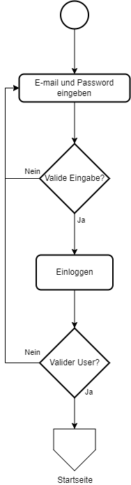

**Ablaufdiagramm der Registrierung**
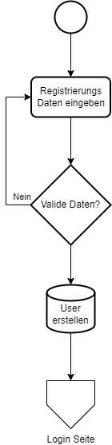

**Ablaufdiagramm des Profils**
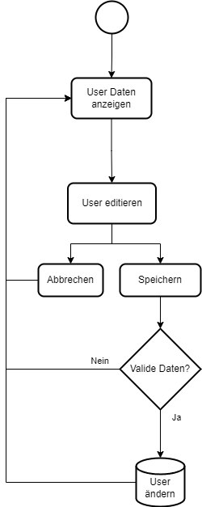

**Ablaufdiagramm der Parkplatzdetails**
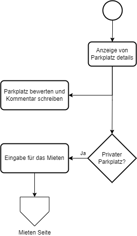

**Ablaufdiagramm des Mieten eines Parkplatzes**
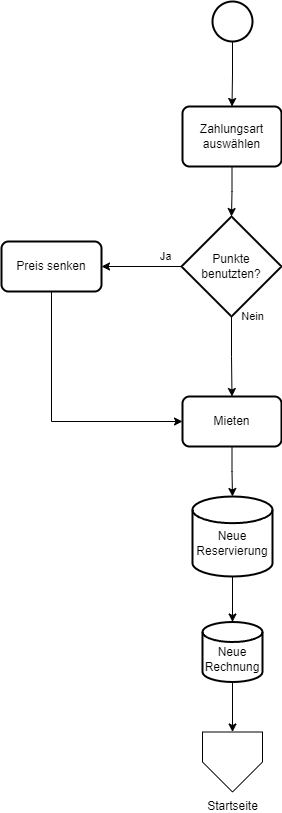

**Ablaufdiagramm des Editieren eines Parkplatzes**
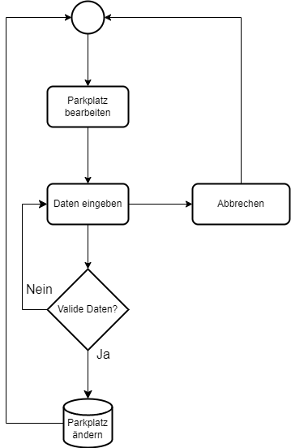

**Ablaufdiagramm des Melden eines Parkplatzes**
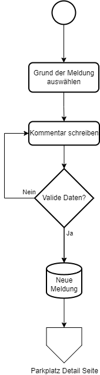

**Ablaufdiagramm der Buchungen eines Nutzers**
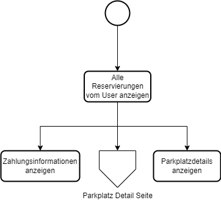

**Ablaufdiagramm der Meldungen eines Nutzers**
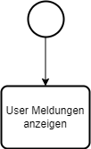

**Ablaufdiagramm der Parkplatz Übersicht eines Nutzers**
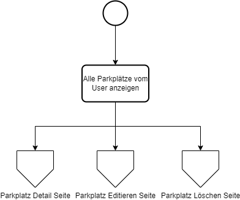

## 3.7 Fehlerbehandlung

### Technische Fehler
1. **Fehler: Server nicht erreichbar**
   - **Status:** 404
   
2. **Fehler: Zeitüberschreitung bei der Netzwerkanfrage**
   - **Status:** 500
  
3. **Fehler: Fehler beim Ausführen der Datenbankanfrage**
   - **Status:** 500

### Fachliche Fehler
1. **Fehler: Fehlendes oder ungültiges JWT-Token**
   - **Status:** 401
   - **Beschreibung:** Der Nutzer hat kein oder ein ungültiges JWT-Token übergeben.

2. **Fehler: Ungültige Login-Daten**
   - **Status:** 401
  
3. **Fehler: Nutzer mit dieser/diesem Email/Nutzernamen existiert bereits**
   - **Status:** 400

4. **Fehler: Nutzer konnte nicht gefunden werden**
   - **Status:** 404 
   - **Beschreibung:** Der Nutzer konnte nicht in der Datenbank gefunden werden.

5. **Fehler: Parkplatz konnte nicht gefunden werden**
   - **Status:** 404
   - **Beschreibung:** Es konnte kein Parkplatz mit der übergenen ID gefunden werden.
  
6. **Fehler: Keine Rechnung für diese Reservierung gefunden**
   - **Status:** 404
   - **Beschreibung:** Es konnte keine Rechnung für die übergene Reservierungs ID gefunden werden.

## 3.8 Validierung

**User Interface-Integrationstestfälle**
**Ziel**: Sicherstellen, dass das User Interface korrekt mit Backend-Services interagiert und eine nahtlose Nutzererfahrung bietet.

| **Testfall**                                         | **Beschreibung**                                                                                                                                              | **Erwartetes Ergebnis**                                                                                                   |
| ---------------------------------------------------- | ------------------------------------------------------------------------------------------------------------------------------------------------------------- | ------------------------------------------------------------------------------------------------------------------------- |
| **App Renders**                                      | Überprüfen, ob die App korrekt gerendert wird und alle UI-Elemente sichtbar sind.                                                                             | Die App wird korrekt gerendert und alle UI-Elemente sind sichtbar.                                                        |
| **Map Renders**                                      | Überprüfen, ob die Karte korrekt gerendert wird.                                                                                                              | Die Karte wird korrekt gerendert.                                                                                         |
| **Marker Menu Renders**                              | Überprüfen, ob das Marker-Menü korrekt gerendert wird.                                                                                                        | Das Marker-Menü wird korrekt gerendert.                                                                                   |
| **Parkingspace List contains 3 items**               | Überprüfen, ob die Parkplatzliste 3 Elemente enthält.                                                                                                         | Die Parkplatzliste enthält 3 Elemente.                                                                                    |
| **Clicking the first item in the Parkingspace List** | Überprüfen, ob das erste Element in der Parkplatzliste korrekt angezeigt wird und wenn darauf geklickt wird die Kamera der Karte auf den Parkplatz zentriert. | Das erste Element in der Parkplatzliste wird korrekt angezeigt und die Kamera der Karte wird auf den Parkplatz zentriert. |
| **Login with invalid email**                         | Überprüfen, ob der Benutzer mit einer ungültigen E-Mail-Adresse nicht eingeloggt werden kann.                                                                 | Der Benutzer kann sich nicht mit einer ungültigen E-Mail-Adresse einloggen.                                               |
| **Login with valid email**                           | Überprüfen, ob der Benutzer mit einer gültigen E-Mail-Adresse eingeloggt werden kann.                                                                         | Der Benutzer kann sich mit einer gültigen E-Mail-Adresse einloggen.                                                       |
| **Register with invalid email**                      | Überprüfen, ob der Benutzer mit einer ungültigen E-Mail-Adresse nicht registriert werden kann.                                                                | Der Benutzer kann sich nicht mit einer ungültigen E-Mail-Adresse registrieren.                                            |
| **Register with valid email**                        | Überprüfen, ob der Benutzer mit einer gültigen E-Mail-Adresse registriert werden kann.                                                                        | Der Benutzer kann sich mit einer gültigen E-Mail-Adresse registrieren.                                                    |
| **Register with invalid password**                   | Überprüfen, ob der Benutzer mit einem ungültigen Passwort nicht registriert werden kann.                                                                      | Der Benutzer kann sich nicht mit einem ungültigen Passwort registrieren.                                                  |
| **Register with valid password**                     | Überprüfen, ob der Benutzer mit einem gültigen Passwort registriert werden kann.                                                                              | Der Benutzer kann sich mit einem gültigen Passwort registrieren.                                                          |
| **Register with invalid birthdate**                  | Überprüfen, ob der Benutzer mit einem ungültigen Geburtsdatum nicht registriert werden kann.                                                                  | Der Benutzer kann sich nicht mit einem ungültigen Geburtsdatum registrieren.                                              |
| **Register with valid birthdate**                    | Überprüfen, ob der Benutzer mit einem gültigen Geburtsdatum registriert werden kann.                                                                          | Der Benutzer kann sich mit einem gültigen Geburtsdatum registrieren.                                                      |
| **Register with valid data**                         | Überprüfen, ob der Benutzer mit gültigen Daten registriert werden kann.                                                                                       | Der Benutzer kann sich mit gültigen Daten registrieren.       

# 4 Projektorganisation

## 4.1 Annahmen
* Verwendete Technologien:
    - DB: MySQL, SQL
    - Server: Node.js, Express.js
    - Clients: Kotlin Multiplatform Mobile (KMM) für Mobile (Android, iOS), Kotlin/JS für Web
    - Bibliotheken: Leaflet oder MapTiler für Kartenintegration, ...
* Repositories
    - Backend (Server)
    - Clients (App, Web)
    - Dokumentation

* Einschränkungen, Betriebsbedingungen und Faktoren, die die Entwicklung beeinflussen (Betriebssysteme, Entwicklungsumgebung)
   * IOS-Client: Für die Entwicklung in Swif ist eventuell ein Mac nötig

## 4.2 Verantwortlichkeiten
| Funktion / Relevanz                                                             | Name                 | Kontakt / Verfügbarkeit       |
| ------------------------------------------------------------------------------- | -------------------- | ----------------------------- |
| Product Owner, DevOps-Engineer, Backend-Entwickler                              | Timo Haverich        | timo.haverich@hsbi.de         |
| Product Owner, UX/UI Designer, Soundentwickeler, Frontend-Entwickler (App-Team) | Marvin Petschulat    | marvin.petschulat@hsbi.de     |
| Product Owner, Frontend-Entwickler (Web-Team), DevOps-Engineer                  | Edwin Dik            | edwin.dik@hsbi.de             |
| Product Owner, Frontend-Entwickler (Web-Team)                                   | Bent Schöne          | bent.schoene@hsbi.de          |
| Product Owner, Frontend-Entwickler (Web-Team)                                   | Mattis Wellenbüscher | mattis.wellenbuescher@hsbi.de |
| Product Owner, UX/UI Designer, Frontend-Entwickler (App-Team), DevOps-Engineer  | Tim Röckemann        | tim.roeckemann@hsbi.de        |
| Product Owner, UX/UI Designer, Frontend-Entwickler (App-Team)                   | Jan-Ole Löffler      | jan-ole_timo.loeffler@hsbi.de |

## 4.3 Grober Projektplan

### Meilensteine

* 13.05.2024
   - Anzeigen einer Karte aus einer API auf allen Clients

* 10.06.2024
   - Authentifizierung der User und basierend darauf Parkplätze suchen, anlegen und bewerten

* 24.06.2024
   - Parkplätze mieten und vermieten

* 01.07.2024
   - Anpassung UX/UI der Clients und Optimierungen

* 08.07.2024
   - Abnahmetests

* 15.07. – 26.07.2024
   - Präsentation 
