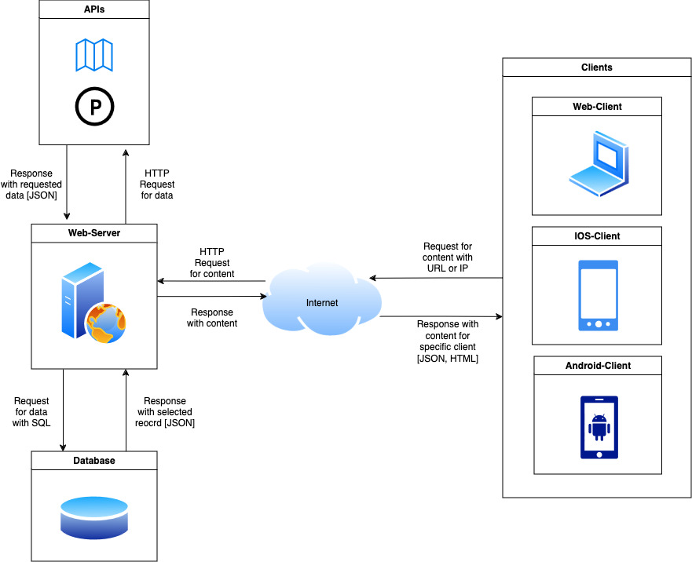

# Pflichtenheft - TeamC2

* **Projektname:** ParkBlazer
* **Product Owner:** Tim Röckemann, Marvin Petschulat, Jan-Ole Löffler, Timo Haverich, Edwin Dik, Bent Schöne, Mattis Wellenbüscher
* [Link zum Source Code Repository](https://github.com/TeamC2-Softwareprojekt)

# 1 Einführung

## 1.1 Beschreibung
Die Produktvision von **ParkBlazer** ist es, eine innovative Plattform zu schaffen, die die Art und Weise revolutioniert, wie Autofahrer Parkplätze finden und nutzen. Wir streben danach, Verkehrsstaus und Umweltbelastungen in urbanen Gebieten zu reduzieren, indem wir eine Community-basierte Lösung bieten, die es Nutzern ermöglicht, unentdeckte Parkplätze zu finden und private Parkplätze zu mieten bzw. vermieten. **ParkBlazer** wird durch den Community-basierten Ansatz die Parkplatzsuche vereinfachen und gleichzeitig die Verfügbarkeit von Parkplätzen erhöhen. Durch die Möglichkeit, private Parkplätze über einen bestimmten Zeitraum von anderen Nutzern mieten zu können, schafft **ParkBlazer** eine flexible und kostengünstige Alternative zum herkömmlichen Parken. Dies ermöglicht es Nutzern, ihren Parkbedarf je nach Bedarf anzupassen und gleichzeitig privaten Parkplatzanbietern die Möglichkeit zu geben, ihre ungenutzten Parkplätze zu monetarisieren und die Parkraumnutzung in städtischen Gebieten zu optimieren. Unsere Plattform wird auf Benutzerfreundlichkeit, Zuverlässigkeit und Innovation setzen, um ein nahtloses und effizientes Parkerlebnis zu gewährleisten und die Lebensqualität in städtischen Gebieten zu verbessern.

# 2 Anforderungen

## 2.1 Stakeholder
| Funktion / Relevanz | Name | Kontakt / Verfügbarkeit |
|---|---|---|
| Product Owner, DevOps-Engineer, Backend-Entwickler | Timo Haverich | timo.haverich@hsbi.de |
| Product Owner, UX/UI Designer, Soundentwickeler, Frontend-Entwickler (App-Team) | Marvin Petschulat | marvin.petschulat@hsbi.de |
| Product Owner, Frontend-Entwickler (Web-Team), DevOps-Engineer | Edwin Dik | edwin.dik@hsbi.de |
| Product Owner, Frontend-Entwickler (Web-Team) | Bent Schöne | bent.schoene@hsbi.de |
| Product Owner, Frontend-Entwickler (Web-Team) | Mattis Wellenbüscher | mattis.wellenbuescher@hsbi.de |
| Product Owner, UX/UI Designer, Frontend-Entwickler (App-Team), DevOps-Engineer | Tim Röckemann | tim.roeckemann@hsbi.de |
| Product Owner, UX/UI Designer, Frontend-Entwickler (App-Team) | Jan-Ole Löffler | jan-ole_timo.loeffler@hsbi.de |

## 2.2 Funktionale Anforderungen
- Die Use Cases wurden in folgende funktionale Gruppen strukturiert:
    - Authentifizierung und Zugriffssteuerung
    - Profilverwaltung
    - Bestellungsverwaltung
    - Parkplatzsuche
    - Parkplatz anlegen
    - Parkplatz mieten/vermieten
    - Parkplatz bewerten

- Definition der Akteure:
    - Registrierter Benutzer: Benutzer des Systems, der auf alle Funktionen zugreifen kann.
    - Anonymer Benutzer: Benutzer des Systems, der auf frei zugängliche Funktionen zugreifen kann (Parkplatzsuche).

## 2.3 Nicht-funktionale Anforderungen

### 2.3.1 Rahmenbedingungen
- **Kollaborative Softwareentwicklung mit Github im Team:**
  - Einrichten eines gemeinsamen Github-Repositories für das Projekt.
  - Nutzung von Branches für die parallele Entwicklung verschiedener Funktionen oder Features.
  - Verwendung von Pull Requests für Code-Reviews und die Integration von Änderungen in den Hauptcode.
  - Verfolgung von Aufgaben und Fortschritt mithilfe von Issues und Projekt-Boards.

- **Planung und Durchführung des Softwareprojekts:**
  - Festlegung der Anforderungen und Spezifikationen in Zusammenarbeit mit dem Team und den Stakeholdern.
  - Einteilung der Arbeit in Iterationen oder Sprints, um kontinuierliche Verbesserungen und Lieferungen zu ermöglichen.
  - Regelmäßige Meetings zur Überprüfung des Fortschritts, zur Identifizierung von Hindernissen und zur Anpassung des Plans, falls erforderlich.
  - Durchführung von Tests und Qualitätssicherungsmaßnahmen während des gesamten Entwicklungsprozesses.

- **Anwendung agiler Vorgehensmodelle (Scrum, Kanban-Board):**
  - Nutzung eines Kanban-Boards zur Visualisierung des Arbeitsfortschritts und zur Priorisierung von Aufgaben.
  - Verwendung von Scrum-Meetings wie Sprint-Planung, Daily Standups und Sprint-Reviews, um den Fortschritt zu überprüfen und Herausforderungen anzugehen.
  - Kontinuierliche Verbesserung durch retrospektive Meetings, um Erfahrungen zu reflektieren und Anpassungen vorzunehmen.

- **Erweiterung der Kompetenzen durch Einarbeitung in neue Technologien:**
  - Identifizierung von neuen Technologien oder Tools, die für das Projekt nützlich sein könnten.
  - Planung von Zeit für die Einarbeitung und das Erlernen neuer Technologien innerhalb des Teams.
  - Durchführung von Experimenten, Prototypen oder kleinen Projekten, um praktische Erfahrungen zu sammeln.

- **Selbstständigkeit im Lernen, Verstehen, Planen, Organisieren, Kommunizieren, Präsentieren und Zusammenarbeit im Team:**
  - Eigenverantwortung für die Fortbildung und das Verständnis neuer Konzepte oder Technologien.
  - Effektive Planung und Organisation von Arbeitsaufgaben und Zeit.
  - Klare und offene Kommunikation im Team, um Ideen auszutauschen, Herausforderungen zu besprechen und Lösungen zu finden.
  - Fähigkeit, Ergebnisse und Fortschritte präsentieren zu können, sowohl innerhalb des Teams als auch gegenüber Stakeholdern.
  - Zusammenarbeit und Unterstützung anderer Teammitglieder, um gemeinsame Ziele zu erreichen und eine positive Arbeitsumgebung zu fördern.

### 2.3.2 Betriebsbedingungen
- Das Softwareprodukt kann als Webanwendung, mobile Anwendung, eingebettete Software oder Desktop-Software realisiert werden.
- Es kann in einer oder mehreren Programmiersprachen implementiert werden, je nach den Anforderungen und Präferenzen des Teams.
- Eine graphische Benutzerschnittstelle ist obligatorisch und muss vorhanden sein.
- Die Verwendung einer Datenbank ist erforderlich, um Daten zu speichern und abzurufen.
- Die Entwicklung von mehreren "Frontends" für das Softwareprodukt wird empfohlen, insbesondere bei einem Team von mehr als 2 Personen.
- Diese "Frontends" können webbasiert, für mobile Endgeräte oder für Sprachassistenten sein, um eine breitere Benutzerbasis zu erreichen und die Benutzererfahrung zu verbessern.

### 2.3.3 Qualitätsmerkmale
* Externe Qualitätsanforderungen (z.B. Performance, Sicherheit, Zuverlässigkeit, Benutzerfreundlichkeit)
Qualitätsmerkmal | sehr gut | gut | normal | nicht relevant
---|---|---|---|---
**Zuverlässigkeit** | | | | |
Fehlertoleranz |X|-|-|-|
Wiederherstellbarkeit |X|-|-|-|
Ordnungsmäßigkeit |X|-|-|-|
Richtigkeit |X|-|-|-|
Konformität |-|X|-|-|
**Benutzerfreundlichkeit** | | | | |
Installierbarkeit |-|-|X|-|
Verständlichkeit |X|-|-|-|
Erlernbarkeit |-|-|x|-|
Bedienbarkeit |x|-|-|-|
**Performance** | | | | |
Zeitverhalten |x|-|-|-|
Effizienz|x|-|-|-|
**Sicherheit** | | | | |
Analysierbarkeit |X|-|-|-|
Modifizierbarkeit |x|-|-|-|
Stabilität |-|x|-|-|
Prüfbarkeit |X|-|-|-|

## 2.4 Graphische Benutzerschnittstelle
**Login**

**Starseite**

**Neuer Parkplatz: Suche der Adresse**

**Neuer Parkplatz: Hinzufügen**

**Neuer Parkplatz: Details hinzufügen**

**Parkplatz suchen: Adresse**

**Parkplatz suchen: Auswahl der Parkplätze**

**Parkplatz suchen: Parkplatzdetails**

**Parkplatz vermieten: Adresse suchen**

**Parkplatz vermieten: Parkplatz hinzufügen**

**Parkplatz vermieten: Parkplatzdetails und Verifizierung**

**Profil: Berwertungen**

## 2.5 Anforderungen im Detail
| Als        | möchte ich                                 | so dass                                     | Akzeptanz                        |
| :--------- | :---------------------------------------- | :------------------------------------------ | :------------------------------- |
| Autofahrer | freie Parkplätze in meiner Nähe finden    | ich weniger Zeit mit der Parkplatzsuche verbringe | Die App zeigt verfügbare Parkplätze auf einer Karte an. |
| Parkplatzbesitzer | meinen nicht genutzten Parkplatz vermieten | ich zusätzliches Einkommen generieren kann  | Ein Mietvertrag kann über die Plattform abgeschlossen werden. |
| Umweltbewusster Nutzer | eine App zur Parkplatzsuche nutzen   | ich zur Reduzierung von Verkehrsstaus und Umweltbelastungen beitrage | Die App bietet Informationen über die Auswirkungen der Parkraumnutzung auf die Umwelt. |
| Pendler    | Parkplätze für bestimmte Zeiten reservieren | ich sicher sein kann, dass ein Parkplatz verfügbar ist, wenn ich ihn benötige | Nutzer können Reservierungen für bestimmte Zeiten und Tage vornehmen. |
| Geschäftsreisender | Parkplätze nahe wichtiger Geschäftsorte finden     | ich zu meinen Meetings pünktlich und entspannt ankomme  | Die App zeigt Parkplätze in der Nähe von Bürogebäuden oder Meeting-Spots. |
| Stadtbewohner   | langfristige Parkmöglichkeiten mieten             | ich mir keine täglichen Sorgen um die Parkplatzsuche machen muss | Nutzer können Parkplätze für Wochen oder Monate mieten. |
| Tourist         | Informationen über Parkgebühren und -regeln erhalten | ich Parkstrafen vermeiden kann                          | Die App bietet detaillierte Informationen zu lokalen Parkvorschriften und Kosten. |
| App-Entwickler  | Feedback von Nutzern erhalten                       | ich die App verbessern und benutzerfreundlicher machen kann | Ein Feedback-System ist integriert, das Nutzerbewertungen und -vorschläge sammelt. |
| Anwohner        | über die Verfügbarkeit von Parkplätzen in meiner Gegend informiert werden | ich meine Fahrtrouten und -zeiten besser planen kann   | Die App sendet Benachrichtigungen über aktuelle Parkplatzsituationen in Echtzeit. |
| Stadtplaner     | Daten über Parkraumnutzung analysieren             | städtische Verkehrs- und Parkraumplanung optimiert werden kann | Die App stellt aggregierte Daten zur Verfügung, die die Parkgewohnheiten und Spitzenzeiten zeigen. |
| Reisender        | Parkplätze nahe Flughäfen und Bahnhöfen finden   | ich meine Reise stressfrei beginnen kann                     | Die App zeigt verfügbare Parkplätze an Verkehrsknotenpunkten an. |
| Event-Organisator | verfügbare Parkplätze für Eventbesucher anbieten | Besucher leichter einen Parkplatz finden und pünktlich sein können | Nutzer können Parkplätze speziell für Veranstaltungen reservieren. |
| Autovermieter    | Kooperationen mit Parkplatzanbietern aufbauen    | Kunden nahtlose Parkmöglichkeiten bieten können              | Die App ermöglicht es, Partnerschaften über eine spezielle Schnittstelle zu verwalten. |
| Immobilienverwalter | effiziente Nutzung von Parkflächen sicherstellen | die Parkraumkapazitäten optimal genutzt werden               | Die App ermöglicht eine dynamische Verwaltung und Buchung von Parkflächen. |
| Mobilitätsanalyst | Trends in der Parkplatznutzung analysieren      | datengestützte Entscheidungen für Stadtplanung treffen können | Die App liefert detaillierte Statistiken und Nutzungsmuster in Echtzeit. |

# 3 Technische Beschreibung

## 3.1 Systemübersicht / Systemarchitekturdiagramm

## 3.2 Softwarearchitektur
### Server
Der Server ist das zentrale Element der Plattform, das die Geschäftslogik und die Datenhaltung verwaltet. Der Server greift auf die verwendeten APIs und Datenbanken zu und sendet die Daten zurück an den anfordernden Client.

#### Logik-Schicht
- **Aufgaben:** Empfängt und verarbeitet Anfragen von Clients über das Web.
- **Technologien:** Node.js, Express.js

### Client
Der Client ist die Benutzeroberfläche, über die Nutzer mit der PARCAR-Plattform interagieren.

#### UI-Schicht
- **Aufgaben:** Darstellung der Benutzeroberfläche auf verschiedenen Plattformen (Web, Mobile).
- **Technologien:** Kotlin Multiplatform Mobile (KMM) für Mobile (Android, iOS), Kotlin/JS für Web, Leaflet oder MapTiler für Kartenintegration.

#### Kommunikation-Schicht
- **Aufgaben:** Handhabt die Kommunikation zwischen Client und Server über das Netzwerk.
- **Technologien:** HTTP, WebSocket(für Echtzeitaktualisierungen), Express.js

#### Logik-Schicht
- **Aufgaben:** Verarbeitet Geschäftslogik, wie das Management von Parkplatzdaten, Nutzeranfragen und Transaktionen.
- **Technologien:** Kotlin (Java Spring Boot, Ktor) oder Flutter

### 3.2.1 Technologieauswahl
- DB: MySQL
- Server: Node.js, Express.js
- Clients: Kotlin Multiplatform Mobile (KMM) für Mobile (Android, iOS), Kotlin/JS für Web, (Flutter), Swift
- Bibliotheken: Leaflet oder MapTiler für Kartenintegration

## 3.3 Schnittstellen
- Leaflet oder MapTiler -> Server (Backend) -> Clients
- Datenbank -> Server (Backend) -> Clients
- Andere APIs? -> Server (Backend) -> Clients

## 3.3.1 Ereignisse
1. **Ereignistyp: Parkplatz Verfügbarkeit**
   - **Attribute:**
      - Ereignistyp: "Parkplatz Verfügbar"
      - Zeitstempel: Datum und Uhrzeit der Verfügbarkeitsmeldung
      - Parkplatz-ID: Eindeutige Identifikation des Parkplatzes
      - Standort: Geographische Lage des Parkplatzes

2. **Ereignistyp: Parkplatz Reservierung (Privat)**
   - **Attribute:**
      - Ereignistyp: "Parkplatz Reserviert"
      - Zeitstempel: Datum und Uhrzeit der Reservierung
      - Benutzer-ID: Identifikation des Nutzers, der reserviert hat
      - Parkplatz-ID: Eindeutige Identifikation des Parkplatzes
      - Dauer: Reservierungszeitraum

3. **Ereignistyp: Parkplatz Miete (Privat)**
   - **Attribute:**
      - Ereignistyp: "Parkplatz Gemietet"
      - Zeitstempel: Datum und Uhrzeit der Mietbeginn
      - Benutzer-ID: Identifikation des Mieters
      - Parkplatz-ID: Eindeutige Identifikation des Parkplatzes
      - Mietdauer: Zeitraum der Miete

4. **Ereignistyp: Neue Parkplatzbewertung**
   - **Attribute:**
      - Ereignistyp: "Bewertung Hinzugefügt"
      - Zeitstempel: Datum und Uhrzeit der Bewertung
      - Benutzer-ID: Identifikation des Bewertenden
      - Parkplatz-ID: Eindeutige Identifikation des Parkplatzes
      - Bewertung: Sternbewertung und Kommentar

5. **Ereignistyp: Benutzerlogin**
   - **Attribute:**
      - **Ereignistyp**: "Benutzerlogin"
      - **Zeitstempel**: Datum und Uhrzeit des Logins
      - **Benutzer-ID**: Eindeutige Identifikation des Nutzers
      - **Erfolg**: Gibt an, ob der Login-Versuch erfolgreich war oder nicht
      - **IP-Adresse**: IP-Adresse des Nutzers zum Zeitpunkt des Logins
      - **Gerät**: Informationen über das Gerät, von dem aus der Login erfolgte (z.B. Betriebssystem, Browser)

6. **Ereignistyp: Benutzerregistrierung**
   - **Attribute:**
      - **Ereignistyp**: "Benutzerregistrierung"
      - **Zeitstempel**: Datum und Uhrzeit der Registrierung
      - **Benutzer-ID**: Eindeutige Identifikation des neu registrierten Nutzers
      - **Erfolg**: Gibt an, ob die Registrierung erfolgreich war
      - **IP-Adresse**: IP-Adresse des Nutzers zum Zeitpunkt der Registrierung

7. **Ereignistyp: Benutzerdatenaktualisierung**
   - **Attribute:**
      - **Ereignistyp**: "Benutzerdatenaktualisierung"
      - **Zeitstempel**: Datum und Uhrzeit der Aktualisierung
      - **Benutzer-ID**: Eindeutige Identifikation des Nutzers
      - **Geänderte Felder**: Liste der aktualisierten Datenfelder (z.B. E-Mail-Adresse, Telefonnummer)

## 3.4 Datenmodell

## 3.5 Abläufe

=> Folgt

## 3.7 Fehlerbehandlung

### Technische Fehler
1. **Fehler: Datenbankserver nicht erreichbar**
   - **Fehlercode:** 1001
   - **Beschreibung:** Die Verbindung zum Datenbankserver konnte nicht hergestellt werden.
   
2. **Fehler: Zeitüberschreitung bei der Netzwerkanfrage**
   - **Fehlercode:** 1002
   - **Beschreibung:** Eine Netzwerkanfrage hat die festgelegte Zeitüberschreitung erreicht.

3. **Fehler: Konfigurationsfehler**
   - **Fehlercode:** 1003
   - **Beschreibung:** Fehlerhafte oder fehlende Konfigurationsdaten, die für den Betrieb der Anwendung notwendig sind.

4. **Fehler: Dienst nicht verfügbar**
   - **Fehlercode:** 1004
   - **Beschreibung:** Ein externer Dienst, von dem die Anwendung abhängt, ist temporär nicht verfügbar.

5. **Fehler: Zugriffsverletzung**
   - **Fehlercode:** 1005
   - **Beschreibung:** Ein Zugriffsfehler ist aufgetreten, möglicherweise aufgrund fehlender Berechtigungen.

### Fachliche Fehler
1. **Fehler: Kunde nicht gefunden**
   - **Fehlercode:** 2001
   - **Beschreibung:** Die angegebene User-ID existiert nicht in der Datenbank.

2. **Fehler: Parkplatz nicht verfügbar**
   - **Fehlercode:** 2002
   - **Beschreibung:** Der angeforderte Parkplatz ist zum gewünschten Zeitpunkt nicht verfügbar.

3. **Fehler: Zahlungsfehler**
   - **Fehlercode:** 2003
   - **Beschreibung:** Fehler bei der Verarbeitung der Zahlung.

4. **Fehler: Nachricht wurde bereits gelöscht**
   - **Fehlercode:** 2004
   - **Beschreibung:** Der Nutzer versucht auf eine Nachricht zuzugreifen, die bereits aus dem System entfernt wurde.

5. **Fehler: Reservierung abgelaufen**
   - **Fehlercode:** 2005
   - **Beschreibung:** Der Nutzer versucht, eine Reservierung zu nutzen oder zu verlängern, die bereits abgelaufen ist.

6. **Fehler: Ungültige Eingabe**
   - **Fehlercode:** 2006
   - **Beschreibung:** Die vom Nutzer eingegebenen Daten sind ungültig oder unvollständig.

## 3.8 Validierung
1. **Datenmodell-Integrationstestfälle**
   **Ziel**: Sicherstellen, dass die Datenstrukturen korrekt miteinander interagieren und die Datenintegrität gewahrt bleibt.

   - **Testfall DM1**: Überprüfung der Integrität von Benutzerdaten
     - **Beschreibung**: Erstellen, Aktualisieren und Löschen von Benutzerdaten in der Datenbank.
     - **Use Case ID**: UC1 (Benutzerregistrierung), UC4 (Benutzerdatenaktualisierung)
     - **Erwartetes Ergebnis**: Die Operationen sollten konsistent durchführbar sein, ohne Datenkorruption oder -verlust.
  
   - **Testfall DM2**: Überprüfung der Transaktionslogik für Reservierungen
     - **Beschreibung**: Durchführen einer Reihe von Parkplatzreservierungen und anschließendes Überprüfen der Konsistenz und Richtigkeit der Reservierungsdaten.
     - **Use Case ID**: UC2 (Parkplatz Reservierung)
     - **Erwartetes Ergebnis**: Die Datenbank soll alle Reservierungen korrekt reflektieren, auch wenn diese gleichzeitig durchgeführt werden.

2. **API-Integrationstestfälle**
   **Ziel**: Sicherstellen, dass die API-Endpunkte korrekt zusammenarbeiten und die erwarteten Ergebnisse für Frontend-Operationen liefern.

   - **Testfall API1**: Überprüfung der Authentifizierungsflüsse
     - **Beschreibung**: Testen des Login- und Authentifizierungstokens, um darauf folgende API-Aufrufe zu sichern.
     - **Use Case ID**: UC1 (Benutzerlogin)
     - **Erwartetes Ergebnis**: Authentifizierte Sessions ermöglichen den Zugriff auf geschützte Endpunkte, während abgelehnte Anfragen korrekt gehandhabt werden.

   - **Testfall API2**: Überprüfung der Reservierungsendpunkte
     - **Beschreibung**: Senden von Anfragen zum Erstellen, Ändern und Stornieren von Reservierungen über API-Endpunkte.
     - **Use Case ID**: UC2 (Parkplatz Reservierung)
     - **Erwartetes Ergebnis**: Die API soll korrekt auf gültige und ungültige Anfragen reagieren und die entsprechenden Statuscodes zurückgeben.

3. **User Interface-Integrationstestfälle**
   **Ziel**: Sicherstellen, dass das User Interface korrekt mit Backend-Services interagiert und eine nahtlose Nutzererfahrung bietet.

   - **Testfall UI1**: Überprüfung der Registrierungs- und Login-Flüsse
     - **Beschreibung**: Durchführen von Benutzerregistrierung und -login über das UI, einschließlich Fehlermeldungen bei fehlerhaften Eingaben.
     - **Use Case ID**: UC1 (Benutzerlogin), UC3 (Benutzerregistrierung)
     - **Erwartetes Ergebnis**: Das UI soll korrekte Rückmeldungen geben und den Nutzer entsprechend den Ergebnissen der API-Interaktion leiten.

   - **Testfall UI2**: Interaktionstests für die Reservierungsseite
     - **Beschreibung**: Testen der Interaktionen auf der Reservierungsseite, einschließlich Dateneingabe, Auswahl von Zeitfenstern und Bestätigung von Buchungen.
     - **Use Case ID**: UC2 (Parkplatz Reservierung)
     - **Erwartetes Ergebnis**: Das UI soll alle Benutzereingaben korrekt an das Backend weiterleiten und Feedback über den Status der Reservierung anzeigen.

# 4 Projektorganisation

## 4.1 Annahmen
* Verwendete Technologien:
    - DB: MySQL, SQL
    - Server: Node.js, Express.js
    - Clients: Kotlin Multiplatform Mobile (KMM) für Mobile (Android, iOS), Kotlin/JS für Web
    - Bibliotheken: Leaflet oder MapTiler für Kartenintegration, ...
* Repositories
    - Backend (Server)
    - Clients (App, Web)
    - Dokumentation

* Einschränkungen, Betriebsbedingungen und Faktoren, die die Entwicklung beeinflussen (Betriebssysteme, Entwicklungsumgebung)
   * IOS-Client: Für die Entwicklung in Swif ist eventuell ein Mac nötig

## 4.2 Verantwortlichkeiten
| Funktion / Relevanz | Name | Kontakt / Verfügbarkeit |
|---|---|---|
| Product Owner, DevOps-Engineer, Backend-Entwickler | Timo Haverich | timo.haverich@hsbi.de |
| Product Owner, UX/UI Designer, Soundentwickeler, Frontend-Entwickler (App-Team) | Marvin Petschulat | marvin.petschulat@hsbi.de |
| Product Owner, Frontend-Entwickler (Web-Team), DevOps-Engineer | Edwin Dik | edwin.dik@hsbi.de |
| Product Owner, Frontend-Entwickler (Web-Team) | Bent Schöne | bent.schoene@hsbi.de |
| Product Owner, Frontend-Entwickler (Web-Team) | Mattis Wellenbüscher | mattis.wellenbuescher@hsbi.de |
| Product Owner, UX/UI Designer, Frontend-Entwickler (App-Team), DevOps-Engineer | Tim Röckemann | tim.roeckemann@hsbi.de |
| Product Owner, UX/UI Designer, Frontend-Entwickler (App-Team) | Jan-Ole Löffler | jan-ole_timo.loeffler@hsbi.de |

## 4.3 Grober Projektplan

### Meilensteine

* 13.05.2024
   - Anzeigen einer Karte aus einer API auf allen Clients

* 10.06.2024
   - Authentifizierung der User und basierend darauf Parkplätze suchen, anlegen und bewerten

* 24.06.2024
   - Parkplätze mieten und vermieten

* 01.07.2024
   - Anpassung UX/UI der Clients und Optimierungen

* 08.07.2024
   - Abnahmetests

* 15.07. – 26.07.2024
   - Präsentation 
