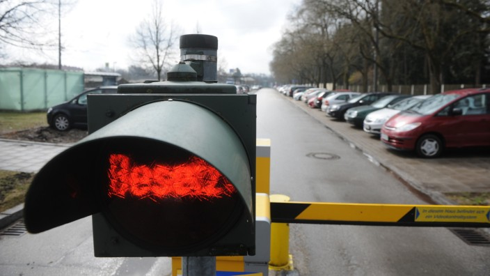
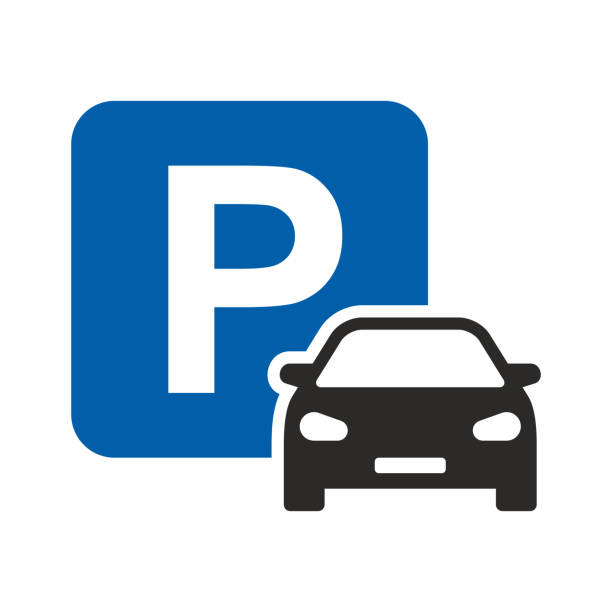

class: center, middle

## [Softwareprojekt](../../praesentationen.html)

#### Team C2

# Softwareproduktidee

Tim Röckemann, Marvin Petschulat, Jan-Ole Löffler,
Timo Haverich, Edwin Dik, Bent Schöne, Mattis Wellenbüscher

---

class: center, middle

## Allgemein

---

### Allgemein: Projektname
***

**ParkBlazer**

- Verbindet das Konzept des "Trailblazers" oder Pioniers mit der Welt der Parkplätze
- "Trailblazer" ist jemand, der neue Wege erkundet und bahnbrechende Entdeckungen macht
- Begriff "Blazer" symbolisiert Geschwindigkeit und Dynamik, was perfekt zur schnellen und effizienten Suche nach Parkplätzen passt

Insgesamt steht __ParkBlazer__ für Innovation, Pioniergeist und Geschwindigkeit in der Welt des Parkens, wobei der Fokus darauf liegt, den Nutzern ein nahtloses und stressfreies Parkerlebnis zu bieten.

---

### Allgemein: Produktvision
***

Die Produktvision von **ParkBlazer** ist es, eine innovative Plattform zu schaffen, die die Art und Weise revolutioniert, wie Autofahrer Parkplätze finden und nutzen. Wir streben danach, Verkehrsstaus und Umweltbelastungen in urbanen Gebieten zu reduzieren, indem wir eine Community-basierte Lösung bieten, die es Nutzern ermöglicht, unentdeckte Parkplätze zu finden und private Parkplätze zu mieten bzw. vermieten. 

[Quelle - SZ](https://www.sueddeutsche.de/image/sz.1.2861440/704x396?v=1519344918)

---

class: center, middle

## Ziele

---

### Ziele: Was sind Ziele des Produkts/des Services?
***
Die Ziele von **ParkBlazer** sind vielfältig und zielen darauf ab, das Parken in städtischen Gebieten zu verbessern und die damit verbundenen Herausforderungen anzugehen. Zu den Hauptzielen gehören:

- Schaffung von mehr Parkplätzen in urbanen Gebieten
- Neue Parkmöglichkeiten erschließen
- Einfache Parkplatzsuche
- Wirtschaften mit Parkplätzen
- Reduzierung von Verkehrsstaus und Umweltbelastung
- Verbesserung der Lebensqualität in städtischen Gebieten

---

### Ziele: Was macht dieses Produkt/der Service anders?
***
Was **ParkBlazer** von anderen Parkplatz-Apps unterscheidet, sind mehrere innovative Merkmale:

- Erschließung von unentdeckten Parkmöglichkeiten
- Community-basierter Ansatz
- Kein Fokus auf öffentliche Parkplätze
- Private Parkplätze vermieten/mieten

---

### Ziele: Was ist das Softwareprodukt nicht?
***
**ParkBlazer** bietet keine Dienste oder Funktionen für folgende Zwecke an:

- Öffentliche Parkplatzsuche
- Standardisierte Parkplatzverwaltung für Unternehmen
- Reservierungen für öffentliche Parkhäuser oder Parkplätze
- Lösungen für langfristige Parkplatzmieten

---

### Ziele: Zu welchen anderen Produkten steht das Produkt in Konkurrenz?
***

Insgesamt konkurriert **ParkBlazer** mit einer Vielzahl von Parkplatz-Apps und Diensten sowie anderen innovativen Parkplatzlösungen, die alle darauf abzielen, die Parkplatzsuche und -nutzung zu optimieren. Beispiele: Parkster, Parkopedia und lokale Park-Apps von Städten oder privaten Parkplatzbetreibern. 

__ParkBlazer ist in der Kombination der Funktionen allerdings einzigartig.__

---

### Ziele: Wie kann mit dem Produkt Geld verdient werden?
***
**ParkBlazer** kann auf verschiedene Weisen Einnahmen generieren:

- Provisionen von Parkplatzvermietungen
- Premium-Funktionen oder Abonnements
- Werbung und Sponsoring
- Datenlizenzen und Analytik
- Partnerschaften und Integrationen

---

class: center, middle

## Stakeholderanalyse

---

### Stakeholderanalyse: Für wen ist das Produkt/der Service?
***

Das Produkt, **ParkBlazer**, richtet sich an Autofahrer in städtischen Gebieten, die Schwierigkeiten haben, Parkplätze zu finden. Es richtet sich auch an private Parkplatzbesitzer, die ihre ungenutzten Parkplätze vermieten möchten, um zusätzliches Einkommen zu generieren.

---

### Stakeholderanalyse: Welche Stakeholder sind betroffen?
***
**ParkBlazer** richtet sich an verschiedene Stakeholder-Gruppen, darunter:

- Autofahrer
- Parkplatzbesitzer
- Stadtverwaltungen
- Geschäfte und lokale Unternehmen
- Gesellschaft/Umweltschutzorganisationen

---

### Stakeholderanalyse: Was sind die Bedürfnisse, die das Produkt befriedigt?
***
**Die Bedürfnisse:**

- der Autofahrer nach einer schnellen und einfachen Parkplatzsuche in städtischen Gebieten
- von Parkplatzbesitzern nach einer Möglichkeit, ihre ungenutzten Parkplätze zu vermieten und zusätzliches Einkommen zu generieren
- der Stadtverwaltungen nach einer Optimierung der Parkplatznutzung und einer Reduzierung von Verkehrsstaus
- von Geschäften und lokalen Unternehmen nach einer Erhöhung der Kundenzufriedenheit durch verbesserte Parkmöglichkeiten
- von Umweltschutzorganisationen nach Maßnahmen zur Reduzierung der Umweltbelastung durch Verkehrsstaus und Luftverschmutzung
- der Gesellschaft nach einer soliden Parplatzsituation und sauberer Luft

---

### Stakeholderanalyse: Was ist die Zielbenutzergruppe und deren Merkmale (Bildung, Erfahrung, Sachkenntnis)?
***
**Merkmale:**

- Bildung: Keine spezifischen Anforderungen an die Bildung.
- Erfahrung: Erfahrung im Autofahren und in der Nutzung von mobilen Anwendungen.
- Sachkenntnis: Grundlegendes Verständnis für die Nutzung von mobilen Anwendungen und Navigationstechnologien.

---

### Stakeholderanalyse: Warum sollte der Kunde dieses Produkt/den Service „kaufen“ oder nutzen?
***

- Autofahrer: Parkplatzsuche vereinfachen und Zeit sowie Stress sparen
- Parkplatzbesitzer: ungenutzten Parkplätze vermieten und zusätzliches Einkommen generieren
- Stadtverwaltungen: Parkplatznutzung optimieren und Verkehrsstaus reduzieren
- Geschäfte und lokale Unternehmen: Kundenzufriedenheit steigern und Kunden zu ihren Standorten führen

---

class: center, middle

## Risikoanalyse

---

### Risikoanalyse: Was ist der Aufwand und der erwartete Nutzen?
***

**Aufwand:**
- Entwicklung und Implementierung erfordern beträchtliche Ressourcen in Zeit und Fachkenntnissen
- Entwicklung einer benutzerfreundlichen Anwendung
- Sammlung und Verwaltung von Parkplatzdaten
- Marketing und Nutzergewinnung
- Laufende Wartung und Aktualisierung der Plattform

**Erwarteter Nutzen:**
- Erleichterte Parkplatzsuche für Autofahrer
- Einnahmen für Parkplatzbesitzer durch Vermietung
- Reduzierung von Verkehrsstaus und Umweltbelastung
- Verbesserte Kundenzufriedenheit für Geschäfte durch mehr Parkmöglichkeiten
- Erschließung von neuen Parkmöglichkeiten

---

### Risikoanalyse: Verfügen Sie über die notwendigen Kompetenzen? (Umsetzbarkeit)
***

Das Projekt erfordert ein Team mit einer Vielzahl von Kompetenzen, darunter:

- Softwareentwicklung für mobile und web Anwendungen
- Datenbankmanagement und -integration
- UI/UX-Design
- (Marketing und Kundengewinnung)
- Projektmanagement und Teamkoordination

---

### Risikoanalyse: Welche Risiken und negativen Nebeneffekte sind zu erwarten?
***

Einige Risiken und negative Nebeneffekte, die bei der Entwicklung und Implementierung von **ParkBlazer** auftreten könnten, sind:

- Technische Herausforderungen
- Datenschutz und Sicherheit
- Marktsättigung
- Akzeptanz der Nutzer
- Regulatorische Anforderungen

---

class: center, middle

## Vielen Dank für Ihre Aufmerksamkeit!
**Wir sehen uns dann in der ParkBlazer-App :)**

[Quelle](https://media.istockphoto.com/id/1083622428/de/vektor/auto-parken-symbol.jpg?s=612x612&w=0&k=20&c=oH7MtSibSJf23MAC0-r1e5qwCaipBNfvoTK2eST1xRQ=)
